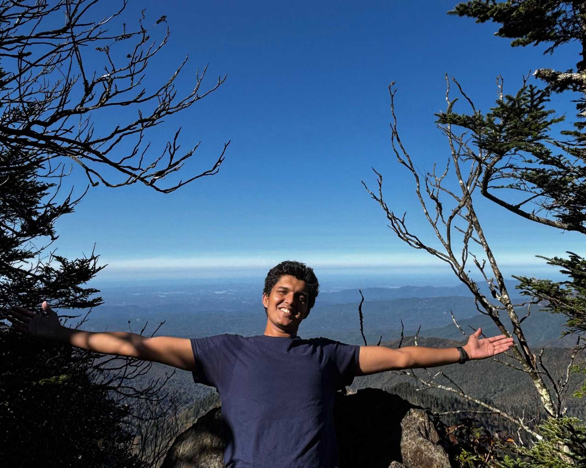

{fig-alt="Kanad Pardeshi" width="75%" fig-align="center"}

::: { .grid .text-center }

:::: {.g-col-4}
[<i class="fa-solid fa-file"></i> Resume](./assets/pdfs/kanad_onepage.pdf)
::::

:::: {.g-col-4}
[<i class="fa-solid fa-microscope"></i> Research](./research.html)
::::

:::: {.g-col-4}
[<i class="fa-brands fa-github"></i> GitHub](https://github.com/KanPard005)
::::

:::: {.g-col-4}
[<i class="fa-brands fa-linkedin"></i> LinkedIn](https://www.linkedin.com/in/kanad-pardeshi/)
::::

:::: {.g-col-4}
[<i class="fa-solid fa-graduation-cap"></i> Scholar](https://scholar.google.com/citations?user=gqcZsEAAAAAJ&hl=en)
::::

:::: {.g-col-4}
[<i class="fa-brands fa-x-twitter"></i> X (Twitter)](https://x.com/KanadPardesh55)
::::

:::

Hello! I am Kanad (pronounced: Kanād), a second-year Ph.D. student in the Machine Learning Department at Carnegie Mellon University. I am co-advised by [Aarti Singh](http://www.cs.cmu.edu/~aarti/) and [Bryan Wilder](https://bryanwilder.github.io/).

**Research Interests**: I am broadly interested in statistical ML, sequential decision-making, and online learning. My previous work has focused on collective decision-making and online loss estimation. I am currently exploring statistical methods to combine human and AI strengths in decision-making. You can find my resume (updated Feb 2026) [here](./assets/pdfs/kanad_onepage.pdf). 

**Previously**:
- I was a Master's in Machine Learning student at CMU for a year, after which I switched to the Ph.D. program. 
- Prior to that, spent four wonderful years as an undergraduate at the Indian Institute of Technology (IIT) Bombay. I majored in Computer Science (Honors with Minor in Applied Statistics and Informatics), conducting research with [Sunita Sarawagi](https://www.cse.iitb.ac.in/~sunita/).
- I have interned at NUS, Adobe Research and IRISA.

**Misc**: I love discussing ideas of any and all kinds, and am particularly susceptible to being [nerd sniped](https://xkcd.com/356/). I'm open to talk about exciting ideas anytime!

{fig-alt="Nerd Sniping" width="75%" fig-align="center" .lightbox}

In my free time, I love reading books, playing sports, and hiking. I'm very big on music, listening to a variety of genres, and I enjoy singing too!

You can contact me at kpardesh [at] andrew [dot] cmu [dot] edu.
